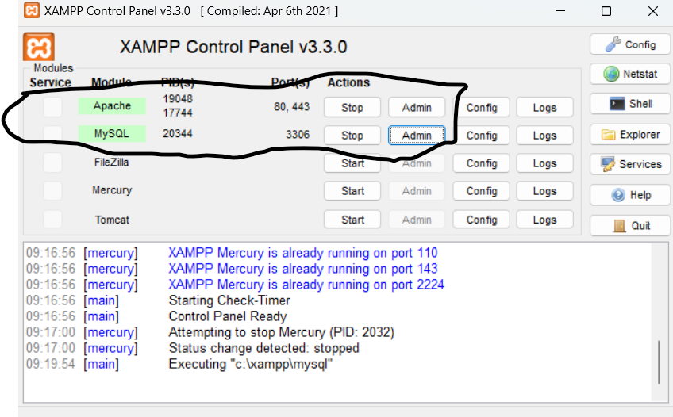
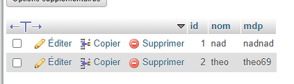
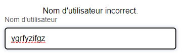

# Pharmadis

## Description
Ce projet est une application web développée à l'aide de XAMPP et Visual Studio Code (VS Code). Il inclut des fonctionnalités telles que l'inscription, la connexion, et la gestion des paramètres utilisateur.

## Table des matières
1. [Installation](#installation)
2. [Utilisation](#utilisation)
3. [Structure des Fichiers](#structure-des-fichiers)
4. [Contributions](#contributions)

## Installation

### Prérequis
- XAMPP : Un logiciel de distribution Apache gratuit contenant MySQL, MariaDB, PHP, et Perl.
- Visual Studio Code (VS Code) : Un éditeur de code source gratuit développé par Microsoft pour Windows, Linux et macOS.

### Installation de XAMPP
1. Téléchargez XAMPP depuis le site officiel : [Apache Friends](https://www.apachefriends.org/index.html)
2. Installez XAMPP en suivant les instructions à l'écran.
3. Lancez XAMPP Control Panel et démarrez les modules **Apache** et **MySQL**.



### Configuration de XAMPP
1. Assurez-vous que les ports par défaut (80 pour Apache et 3306 pour MySQL) ne sont pas utilisés par d'autres applications.
2. Si nécessaire, modifiez les ports dans le fichier `httpd.conf` pour Apache et `my.ini` pour MySQL. Ces fichiers peuvent être trouvés dans le répertoire d'installation de XAMPP (`C:\xampp\apache\conf\httpd.conf` et `C:\xampp\mysql\bin\my.ini`).

### Installation de VS Code
1. Téléchargez Visual Studio Code depuis le site officiel : [Visual Studio Code](https://code.visualstudio.com/)
2. Installez VS Code en suivant les instructions à l'écran.
3. Installez les extensions PHP et PHP Intelephense dans VS Code pour une meilleure expérience de développement.


## Utilisation
Après l'installation, vous pouvez accéder à l'application via votre navigateur web à l'adresse suivante : `http://localhost/nom-du-projet`.>
Les principales fonctionnalités incluent :
- Inscription d'utilisateur
</br> 
Les utilisateurs peuvent s'inscrire et leurs données seront enregistrés dans la base de données.

- Connexion et déconnexion
</br>
Si le MDP est incorect un message d'erreur va l'indiquer tout comme pour le nom d'utilisateur: 

- Mise à jour des paramètres utilisateur
</br>
un onglet settings est disponnible pour modiffier les paramètres du comptes actuel ( le mdp et le nom d'utilisateur) il y'a aussi un bouton supprimer le compte permettant de supprimer le compte actuel de la table.
## Structure des Fichiers
Voici un aperçu de la structure des fichiers et des dossiers du projet :

```plaintext
├── index 1.php
├── index2.css
├── inscription 1.php
├── logout 1.php
├── register 1.php
├── settings.css
├── settings.php
├── success 1.php
├── index 1.css
